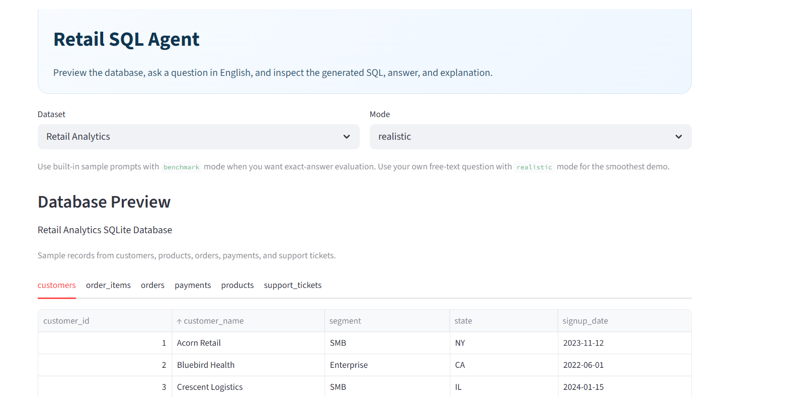
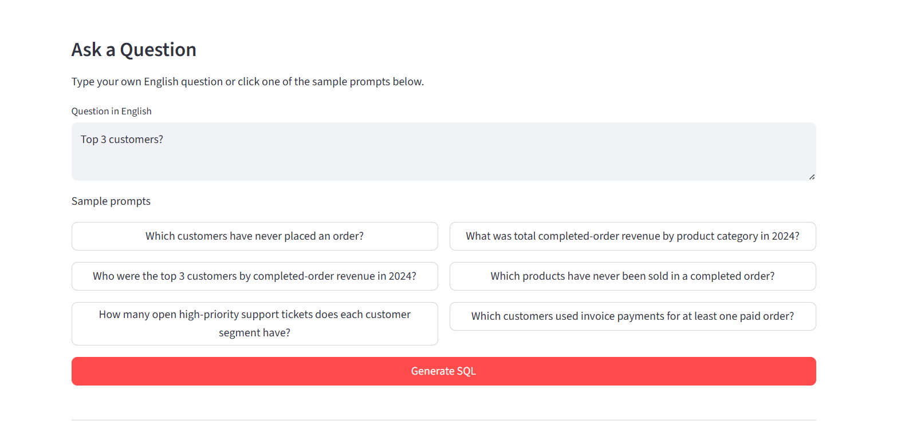
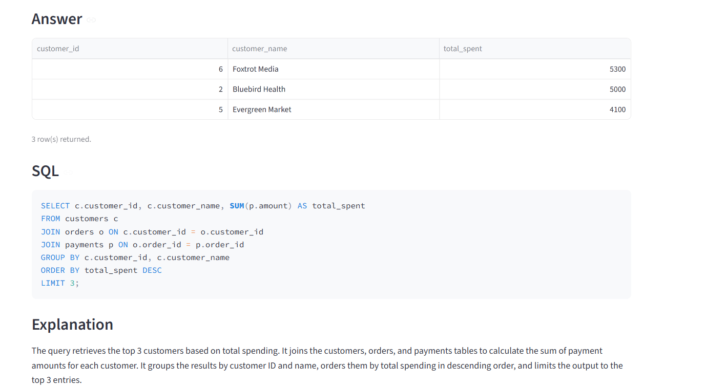

# Retail SQL Agent

This project turns plain-English analytics questions into SQL for a local retail SQLite database. It uses an LLM with tool calling to generate SQL, execute it against the database, inspect the result, and retry when needed.

It is designed to be easy to demo on GitHub:

- one local SQLite database
- one clear Streamlit app
- one benchmark script for repeatable evaluation
- no external warehouse setup required

## What It Does

The app follows a simple flow:

1. Preview the retail database with sample rows.
2. Type a question in English or choose a sample prompt.
3. Let the agent generate SQL and run it.
4. Review the answer, SQL, explanation, and retry trace.

Example questions:

- `Which customers have never placed an order?`
- `Who were the top 3 customers by completed-order revenue in 2024?`
- `Which products have never been sold in a completed order?`
- `What was total completed-order revenue by product category in 2024?`

## Database

The local database is SQLite and is created from the files under [data/retail_analytics](sql-agent-spider-main/data/retail_analytics).

Tables:

- `customers`
- `products`
- `orders`
- `order_items`
- `payments`
- `support_tickets`

This makes the project easy for recruiters or hiring managers to run without installing PostgreSQL or loading external benchmark data.

## Project Structure

```text
.
|-- .env.example
|-- README.md
|-- data/
|   `-- retail_analytics/
|       |-- questions.json
|       |-- schema.sql
|       `-- seed.sql
|-- docs/
|   `-- PORTFOLIO_GUIDE.md
|-- results/
|-- scripts/
|   |-- run_benchmark.py
|   |-- run_demo.py
|   `-- setup_local_db.py
|-- src/
|   `-- retail_sql_agent/
|       |-- agent.py
|       |-- benchmark.py
|       |-- config.py
|       |-- execution.py
|       |-- local_sqlite.py
|       |-- models.py
|       |-- prompts.py
|       `-- warnings_config.py
|-- streamlit_app.py
`-- tests/
```

## Setup

### 1. Create a virtual environment

```powershell
python -m venv .venv
.venv\Scripts\Activate.ps1
```

### 2. Install dependencies

```powershell
pip install -r requirements.txt
```

### 3. Add your OpenAI key

```powershell
Copy-Item .env.example .env
```

Then edit `.env` and set:

```env
OPENAI_API_KEY=your_openai_api_key
```

### 4. Create the local SQLite database

```powershell
python scripts/setup_local_db.py
```

That creates [retail_analytics.db](sql-agent-spider-main/data/retail_analytics/retail_analytics.db).

## How To Run

### Streamlit UI

```powershell
streamlit run streamlit_app.py
```

The UI is organized like this:

1. `Dataset` dropdown
2. `Mode` dropdown
3. `Database Preview` with sample records
4. English question box
5. Sample prompt buttons
6. `Answer`
7. `SQL`
8. `Explanation`
9. `Debug Trace`

#### Screenshots

**Main Dashboard**


**Ask a Question**



**Answer with SQL**



Recommended app flow:

1. Leave `Dataset` on `Retail Analytics`.
2. Use `realistic` for your own custom English questions.
3. Use `benchmark` when you click one of the built-in sample prompts and want exact-answer evaluation.
4. Click `Generate SQL`.

### Run one demo in the terminal

```powershell
python scripts/run_demo.py --mode realistic --question "Which customers have never placed an order?"
```

You can also let it sample one of the built-in benchmark questions:

```powershell
python scripts/run_demo.py --mode benchmark
```

### Run the benchmark script

```powershell
python scripts/run_benchmark.py --num-examples 25 --mode benchmark
```

The retail question bank currently has 6 seeded benchmark tasks, so the script caps to the available questions and writes the results to [benchmark_report.csv](sql-agent-spider-main/results/benchmark_report.csv).

### Run tests

```powershell
python -m pytest -q
```

## Modes

- `realistic`
  Uses execution feedback only. This is the best mode for typing your own English question.
- `benchmark`
  Compares the generated SQL result to the built-in reference SQL for the seeded retail tasks.

## Why This Is Worth Showing

This project demonstrates:

- agentic tool use
- SQL generation and retry loops
- practical backend/data-engineering style schemas
- benchmark logging
- a user-friendly UI that non-technical reviewers can understand

## Good GitHub Repo Name

If you are creating a fresh GitHub repository, a cleaner name than the current local folder would be:

- `retail-sql-agent`
- `text-to-sql-retail-agent`
- `ask-sql-retail`

## Resume Version

Use something like this:

**Retail SQL Agent** | Python, AutoGen, SQLite, Streamlit, OpenAI API

- Built a text-to-SQL agent that converts natural-language analytics questions into executable SQL against a seeded retail database.
- Implemented a tool-driven retry loop that executes generated SQL, classifies failures, and refines queries using execution feedback.
- Shipped a Streamlit UI that lets users preview the database, ask questions in English, and inspect the final SQL, answer, and reasoning trace.

## Notes

- The local `.env`, `.venv`, generated `.db` file, and benchmark outputs are already ignored by [.gitignore](sql-agent-spider-main/.gitignore).
